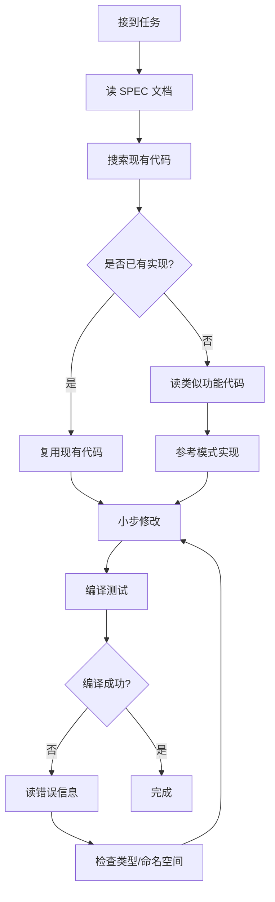

# 架构理解与代码修改指南

## 核心原则

⚠️ **绝对禁止**：
- ❌ 不要猜测或假设代码结构
- ❌ 不要重写已有功能
- ❌ 不要造轮子（已有的系统必须复用）
- ❌ 不要简化架构（保持现有复杂度）

✅ **必须遵守**：
- ✅ 先读 markdown 规范文档
- ✅ 再读已有代码实现
- ✅ 理解现有模式后才动手
- ✅ 复用现有系统和工具类
- ✅ 保持代码风格一致

---

## 第一步：理解项目结构

### 项目组织
```
TheFortressSimulation/
├── src/                          # 源代码
│   ├── HumanFortress.Core/       # 核心类型、内容注册、随机数
│   ├── HumanFortress.Simulation/ # 模拟层（世界、chunk、物品、生物）
│   ├── HumanFortress.Navigation/ # 寻路系统
│   ├── HumanFortress.WorldGen/   # 世界生成
│   └── HumanFortress.App/        # 应用层（UI、渲染）
├── content/                      # 内容定义
│   ├── registries/               # JSON 配置（材料、物品、tuning）
│   └── schemas/                  # JSON Schema 验证
├── data/core/                    # 游戏数据
│   ├── items/                    # 物品定义 JSON
│   ├── placeables/               # 可放置物定义（未来）
│   └── constructions/            # 建造定义（未来）
└── docs/                         # 设计文档（SPEC）
```

### 关键命名空间映射
| 命名空间 | 用途 | 关键类 |
|---------|------|--------|
| `HumanFortress.Core.Content` | 内容加载 | `ContentRegistry` |
| `HumanFortress.Core.Content.Registry` | 定义类型 | `MaterialDefinition`, `PlaceableTuning` |
| `HumanFortress.Core.Random` | 确定性随机 | `DeterministicRng`, `DeterministicGuidGenerator` |
| `HumanFortress.Simulation.World` | 世界管理 | `World`, `Chunk`, `ChunkKey` |
| `HumanFortress.Simulation.Items` | 物品系统 | `ItemInstance`, `ItemDefinition`, `ItemManager` |
| `HumanFortress.Simulation.Placeables` | 可放置物 | `PlaceableInstance`, `ChunkPlaceableData`, `PlaceableManager` |

---

## 第二步：阅读规范文档（必读！）

### 核心架构文档（优先级顺序）

1. **CHUNK_AND_DATA_LAYOUT.md** ⭐⭐⭐
   - 位置：`docs/CHUNK_AND_DATA_LAYOUT.md`
   - 内容：Chunk 架构、Layer 系统（L0-L7）、脏传播规则
   - **必须理解**：
     - Chunk 是 32×32 固定大小
     - Layer 职责（L0=地形, L2=家具/建筑, L5=物品）
     - 脏传播：L0/L2 编辑 → tile + 6邻居
     - FurnitureCell = blocker + passables[] 模式
     - ConnectivityVersion 缓存失效机制

2. **UPDATE_ORDER.md** ⭐⭐⭐
   - 位置：`docs/UPDATE_ORDER.md`
   - 内容：更新管线、阶段顺序、确定性保证
   - **必须理解**：
     - ITick 接口（ReadTick/WriteTick 分离）
     - ApplyCommands 阶段（写 L0/L2/L7）
     - RebuildDerived 阶段（仅重建缓存）
     - 每阶段独立 RNG 流
     - Chunk 并行执行、非重叠写集合

3. **MATERIALS_SPEC.md** ⭐⭐
   - 材料系统规范（v4-min）
   - JSON → `MaterialDefinition` 映射
   - 数值类型（整数 vs 浮点）

4. **ITEMS_SPEC.md** ⭐⭐
   - 物品系统规范（v4-int）
   - 栈叠规则、质量系统、材料引用
   - `ItemInstance` vs `ItemDefinition`

5. **PLACEABLE_SPEC.md** ⭐⭐
   - 可放置物规范（v1.3）
   - Installable vs Construction
   - 足迹（Footprint）、通过性（Passability）
   - 效果计算（方案B：存储计算值）

### 如何阅读 SPEC
```bash
# 先用 Read 工具完整读取 SPEC
Read("docs/CHUNK_AND_DATA_LAYOUT.md")

# 提取关键信息：
# - 数据结构定义
# - 职责边界
# - 约束条件
# - 已有系统引用
```

---

## 第三步：理解现有代码模式

### 模式 1: 确定性系统

**错误示例**：
```csharp
var guid = Guid.NewGuid(); // ❌ 非确定性！
```

**正确模式**：
```csharp
// 1. 先找到现有的 DeterministicRng
Grep("DeterministicRng|DeterministicGuid")

// 2. 使用现有工具
var guid = DeterministicGuidGenerator.GenerateFromPosition(tickSeed, x, y, z);
```

**相关文件**：
- `src/HumanFortress.Core/Random/DeterministicRng.cs`
- `src/HumanFortress.Core/Random/DeterministicGuidGenerator.cs`

---

### 模式 2: Tuning 参数系统

**错误示例**：
```csharp
int beautyBonus = quality * 1; // ❌ 硬编码！
```

**正确模式**：
```csharp
// 1. 检查是否已有 Tuning 类
Grep("class.*Tuning", output_mode="files_with_matches")
// 结果：NavigationTuning.cs, PlaceableTuning.cs

// 2. 参考现有模式创建 Tuning 类
Read("src/HumanFortress.Navigation/NavigationTuning.cs")

// 3. 使用 tuning 参数
tuning ??= PlaceableTuning.Default;
int beautyBonus = quality * tuning.BeautyPerTier;
```

**Tuning 文件位置**：
- JSON：`content/registries/tuning.*.json`
- C# 类：`src/HumanFortress.*/.*Tuning.cs`

---

### 模式 3: ContentRegistry 加载

**错误示例**：
```csharp
// ❌ 自己写 JSON 加载逻辑
var json = File.ReadAllText("data.json");
var data = JsonConvert.DeserializeObject(json);
```

**正确模式**：
```csharp
// 1. 检查 ContentRegistry API
Read("src/HumanFortress.Core/Content/ContentRegistry.cs", offset=360, limit=20)

// 2. 使用现有加载方法
var obj = ContentReg.Instance.GetTuning<JObject>("tuning.placeable", "$");
```

**注意**：有两个 ContentRegistry 类！
- `HumanFortress.Core.Content.ContentRegistry` ← 主注册表（用这个）
- `HumanFortress.Core.Content.Registry.ContentRegistry` ← 基类

---

### 模式 4: Layer 集成（L2 家具/建筑）

**关键概念**：
- **PlaceableInstance** = 权威数据（authoritative）
- **FurnitureRef** = 轻量引用（GUID）
- **FurnitureCell** = 派生缓存（blocker + passables）

**错误示例**：
```csharp
// ❌ 直接替换 FurnitureCell
chunk._furniture[index] = new MyCustomCell();
```

**正确模式**：
```csharp
// 1. 读取现有 Chunk.cs 理解 FurnitureCell
Read("src/HumanFortress.Simulation/World/Chunk.cs")

// 2. PlaceableData → FurnitureCell 同步
var placeableData = chunk.GetPlaceableData();
placeableData.AddPlaceable(localIndex, placeable);
placeableData.SyncToFurnitureCell(chunk, placeable, tick);

// 3. 触发脏传播
chunk.BumpConnectivityVersion();
chunk.MarkTileDirty(localIndex, tick);
```

**相关文件**：
- `src/HumanFortress.Simulation/World/Chunk.cs:242-248` (FurnitureCell)
- `src/HumanFortress.Simulation/Placeables/ChunkPlaceableData.cs:108` (SyncToFurnitureCell)

---

## 第四步：搜索现有实现

### 搜索策略

**场景 1：需要实现新功能前，先找是否已实现**
```bash
# 1. 搜索类名
Grep("class.*Manager|class.*System")

# 2. 搜索方法名
Grep("GetChunk|PlaceFurniture|CreateInstance")

# 3. 搜索模式
Grep("TODO:|FIXME:|NOTE:")
```

**场景 2：理解数据流**
```bash
# 1. 找到数据定义
Grep("class ItemInstance|class PlaceableInstance")

# 2. 找到工厂方法
Grep("Create.*|Build.*|Generate.*", path="Placeables")

# 3. 找到管理类
Grep("Manager|Coordinator|Registry")
```

**场景 3：找类似功能参考**
```bash
# 例如：要实现 PlaceableTuning
# 1. 先找现有 Tuning 类
Grep("class.*Tuning")
# 结果：NavigationTuning.cs

# 2. 读取参考实现
Read("src/HumanFortress.Navigation/NavigationTuning.cs")

# 3. 复制模式，修改细节
```

---

## 第五步：增量修改工作流

### 标准流程



### 实际案例：添加 PlaceableTuning

#### ❌ 错误做法
```
1. 直接创建 PlaceableTuning.cs
2. 猜测 ContentRegistry API
3. 硬编码路径 "data/tuning/placeable.json"
4. 发现编译错误才去查文档
```

#### ✅ 正确做法
```
1. 搜索现有 Tuning 类
   Grep("class.*Tuning")
   → 找到 NavigationTuning.cs

2. 完整阅读参考实现
   Read("src/HumanFortress.Navigation/NavigationTuning.cs")
   → 理解 LoadFromContent() 模式
   → 发现使用 ContentRegistry.Instance.GetTuning()

3. 检查 tuning 文件位置
   Bash("ls content/registries/tuning*.json")
   → 确认路径是 content/registries/

4. 复制模式创建新类
   - 保持命名空间一致
   - 使用相同的加载模式
   - 匹配 JSON 结构

5. 编译测试
   Bash("dotnet build src/HumanFortress.Core/")
   → 发现命名空间冲突
   → 使用 using alias 解决

6. 验证文件复制
   Bash("ls src/.../bin/Debug/.../content/registries/")
   → 确认自动部署成功
```

---

## 第六步：常见陷阱与解决方案

### 陷阱 1: 命名空间混淆

**症状**：
```
error CS0118: 'World' is a namespace but is used like a type
```

**原因**：
```csharp
using HumanFortress.Simulation.World; // 命名空间
// ...
public void Method(World world) // ❌ World 是命名空间！
```

**解决**：
```csharp
// 1. 搜索实际类名
Grep("class World", output_mode="content", "-n", "-C=3")

// 2. 使用 alias
using WorldClass = HumanFortress.Simulation.World.World;
public void Method(WorldClass world) // ✅
```

---

### 陷阱 2: 文件路径错误

**症状**：
```
FileNotFoundException: tuning.placeable.json
```

**调查**：
```bash
# 1. 检查其他 tuning 文件位置
Bash("find . -name 'tuning*.json' -type f")

# 2. 检查构建输出
Bash("ls src/HumanFortress.App/bin/Debug/net8.0/win-x64/content/")

# 3. 确认正确路径
# content/registries/ （不是 data/core/tuning/）
```

---

### 陷阱 3: 重复造轮子

**症状**：实现了一个功能，后来发现已经存在

**预防**：
```bash
# 在写代码前，先全局搜索关键词
Grep("DeterministicGuid|GenerateGuid|CreateGuid")

# 如果找到现有实现，直接复用
# 如果未找到，再继续实现
```

---

### 陷阱 4: 破坏确定性

**症状**：重放不一致、多人游戏同步失败

**检查清单**：
- [ ] 所有 GUID 使用 `DeterministicGuidGenerator`
- [ ] 所有随机数使用 `DeterministicRng`（每阶段独立流）
- [ ] 写操作严格按 chunk/tile 顺序
- [ ] 跨 chunk 操作使用两阶段协议

**验证代码**：
```bash
# 搜索可疑代码
Grep("Guid.NewGuid|Random\(|DateTime.Now|Environment.Tick")
```

---

## 第七步：编译与测试

### 增量编译策略

```bash
# 1. 只编译修改的项目
dotnet build src/HumanFortress.Core/HumanFortress.Core.csproj

# 2. 编译依赖项目
dotnet build src/HumanFortress.Simulation/HumanFortress.Simulation.csproj

# 3. 完整编译（最后）
dotnet build src/HumanFortress.App/HumanFortress.App.csproj

# ❌ 不要直接编译 .sln（已损坏）
```

### 警告处理原则

**可忽略**：
- `CS0618`: Obsolete 警告（已知，计划迁移）
- `CA1822`: 可标记为 static（优化建议）
- `CA1869`: JsonSerializerOptions 缓存（性能建议）

**必须修复**：
- `CS0246`: 找不到类型（命名空间错误）
- `CS1061`: 方法不存在（API 使用错误）
- `CS0103`: 名称不存在（拼写错误）

---

## 快速参考表

### 常用 Grep 模式

| 目标 | 搜索命令 |
|------|---------|
| 找类定义 | `Grep("class ClassName")` |
| 找方法 | `Grep("MethodName", output_mode="content", "-C=5")` |
| 找 TODO | `Grep("TODO\|FIXME\|HACK")` |
| 找某类型用法 | `Grep("PlaceableInstance", type="cs")` |
| 找配置文件 | `Glob("**/*tuning*.json")` |

### 常用文件路径

| 系统 | 定义位置 | 数据位置 |
|------|---------|---------|
| 材料 | `Core/Content/Registry/MaterialDefinition.cs` | `content/registries/materials.*.json` |
| 物品 | `Simulation/Items/ItemDefinition.cs` | `data/core/items/*.json` |
| Tuning | `*/.*Tuning.cs` | `content/registries/tuning.*.json` |
| 可放置物 | `Simulation/Placeables/PlaceableInstance.cs` | （未来）`data/core/placeables/*.json` |

### 代码风格检查清单

- [ ] 命名符合 C# 规范（PascalCase 类/方法，camelCase 字段）
- [ ] 注释使用英文，与用户交流使用中文
- [ ] 使用现有 using 别名模式（如 `ContentReg`）
- [ ] 保持缩进一致（4 空格）
- [ ] 添加 XML 文档注释（`/// <summary>`）
- [ ] 大文件修改使用 Edit 工具（不要 Write 重写）

---

## 总结：黄金法则

1. **先读后写**：阅读 SPEC 和现有代码 > 开始写代码
2. **搜索优先**：Grep 搜索 > 自己实现
3. **模式复用**：复制现有模式 > 发明新模式
4. **小步前进**：增量修改 + 频繁编译 > 大改后再测试
5. **保持一致**：匹配现有风格 > 引入新风格
6. **确定性第一**：使用 DeterministicRng > 标准 Random
7. **提问讨论**：不确定时问用户 > 猜测假设

## 下一步行动

当你接到新任务时：

```bash
# 1. 列出相关 SPEC 文档
Glob("docs/*SPEC*.md")

# 2. 读取相关 SPEC
Read("docs/RELEVANT_SPEC.md")

# 3. 搜索现有实现
Grep("关键词", output_mode="files_with_matches")

# 4. 阅读现有代码
Read("找到的相关文件.cs")

# 5. 与用户讨论方案
"我找到了 X 系统，计划通过 Y 方式修改，是否正确？"

# 6. 获得确认后才开始编码
```

**记住**：这是一个复杂的 Dwarf Fortress 风格游戏，架构精心设计。你的任务是**增强**现有系统，而不是**重建**系统。慢即是快，理解优先。
