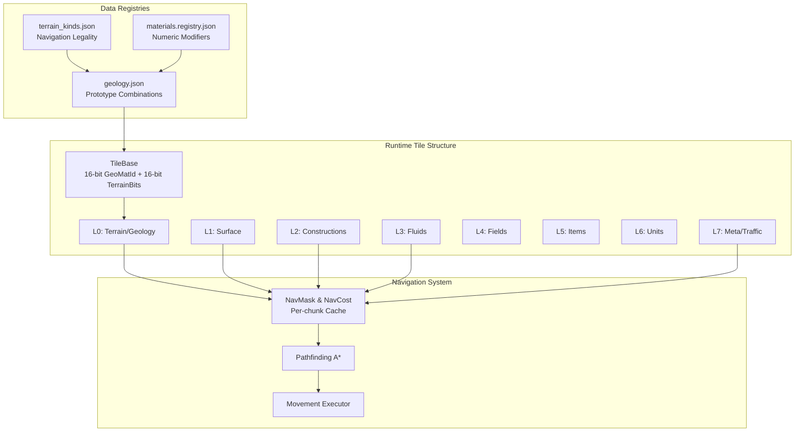

# Tiles, Materials, Geology & Terrain Architecture

## System Overview



## Data Flow Architecture

```
┌─────────────────────────────────────────────────────────────────┐
│                     CONFIGURATION LAYER                          │
├─────────────────┬──────────────────┬────────────────────────────┤
│ terrain_kinds   │    materials     │        geology             │
├─────────────────┼──────────────────┼────────────────────────────┤
│ • TerrainKind   │ • Material Props │ • GeologyPrototype        │
│ • Navigation    │ • Physical       │   = TerrainKind           │
│   - walkable    │   - density      │     + Material            │
│   - standable   │   - hardness     │     + Properties          │
│   - climbable   │   - friction     │       - nav_cost_base     │
│   - flyable     │ • Navigation     │       - opacity           │
│ • Support       │   - costModifier │       - mineable          │
│ • Shape         │   - frictionMod  │ • Creates TileBase        │
│   - SolidWall   │   - hazardLevel  │   - GeoMatId (16-bit)     │
│   - OpenFloor   │ • Mining         │   - TerrainBits (16-bit)  │
│   - Ramp        │ • Value          │                           │
│   - Stairs      │ • Tags           │                           │
└─────────────────┴──────────────────┴────────────────────────────┘
                              │
                              ▼
┌─────────────────────────────────────────────────────────────────┐
│                        TILE STACK (8 Layers)                     │
├───────────────────────────────────────────────────────────────┤
│ L0: Terrain     - TileBase (GeoMatId + TerrainBits)           │
│ L1: Surface     - SurfaceBits (8-bit)                         │
│ L2: Buildables  - BuildableId (16-bit)                        │
│ L3: Fluids      - FluidKind (8-bit) + Depth (3-bit)          │
│ L4: Fields      - FieldMask (8-bit)                           │
│ L5: Items       - ItemListId (16-bit)                         │
│ L6: Units       - UnitListId (16-bit)                         │
│ L7: Meta        - TrafficMask + Designations                  │
└───────────────────────────────────────────────────────────────┘
                              │
                              ▼
┌─────────────────────────────────────────────────────────────────┐
│                     NAVIGATION CACHE                             │
├───────────────────────────────────────────────────────────────┤
│ Per Chunk (32x32):                                             │
│ • NavMask[1024]     - Capability bits per tile                │
│ • NavCost[1024]     - Movement cost per tile                  │
│ • ConnectivityVer   - Cache invalidation version              │
│                                                                │
│ Rebuilt during RebuildDerived() when:                         │
│ • L0 terrain changes                                          │
│ • L2 buildables change                                        │
│ • L3 fluids cross thresholds                                  │
│ • L7 traffic designations change                              │
└───────────────────────────────────────────────────────────────┘
```

## Component Relationships

```
                TerrainKind (Shape + Legality)
                        │
                        ├─── Defines ──────┐
                        │                   │
                        ▼                   ▼
              Navigation Rules         Support Rules
              • walkable               • providesSupport
              • standable              • requiresSupport
              • climbable (reserved)   • maxLoadAbove
              • flyable
              • blocksSight
              • allowsZUp/Down
                        │
    ┌───────────────────┼───────────────────┐
    │                   │                   │
    ▼                   ▼                   ▼
SolidWall          OpenFloor            Ramp/Stairs
(blocks all)       (walkable)           (Z-transition)
    │                   │                   │
    └───────────────────┴───────────────────┘
                        │
                   Combines with
                        │
                        ▼
                Material (Modifiers Only)
                • moveCostModifier
                • frictionModifier
                • hazardLevel
                • physical props
                • mining props
                        │
                        ▼
                GeologyPrototype
                (Final Tile Configuration)
```

## Navigation Decision Flow

```
START: Actor wants to move from A to B
           │
           ▼
    ┌──────────────┐
    │ Check L0     │
    │ TerrainKind  │
    └──────┬───────┘
           │
           ▼
    ┌──────────────┐
    │  Is walkable?│──No──→ [BLOCKED]
    └──────┬───────┘
          Yes
           │
           ▼
    ┌──────────────┐
    │ Check L2     │
    │ Buildables   │
    └──────┬───────┘
           │
           ▼
    ┌──────────────┐
    │  Door closed?│──Yes─→ [BLOCKED unless AllowDoors]
    └──────┬───────┘
          No
           │
           ▼
    ┌──────────────┐
    │ Check L3     │
    │ Fluids       │
    └──────┬───────┘
           │
           ▼
    ┌──────────────┐
    │ Depth > wade?│──Yes─→ [BLOCKED unless Swim]
    └──────┬───────┘
          No
           │
           ▼
    ┌──────────────────┐
    │ Calculate Cost    │
    │ Base (TK)         │
    │ + Material Mod    │
    │ + Fluid Cost      │
    │ + Traffic Adj     │
    └──────┬────────────┘
           │
           ▼
       [ALLOWED]
    with final cost
```

## Bit Layout Detail (CANONICAL - Single Source of Truth)

```
TileBase (32 bits total):
┌─────────────────────────────────┬─────────────────────────────────┐
│        GeoMatId (16 bits)       │      TerrainBits (16 bits)      │
├─────────────────────────────────┼─────────────────────────────────┤
│ References geology.json entry   │ bits 0-2:  TerrainKind (0-7)    │
│ Example: 0x0042 = granite_wall  │ bits 3-5:  RampDirection (0-7)*  │
│                                  │ bit 6:     Natural (1=nat,0=con)│
│                                  │ bit 7:     Smoothed              │
│                                  │ bit 8:     Engraved              │
│                                  │ bits 9-15: Reserved (must be 0) │
└─────────────────────────────────┴─────────────────────────────────┘
* RampDirection only valid when TerrainKind=3 (Ramp)

TerrainKind Values:
0: SolidWall      - Blocks all movement, provides support
1: OpenWithFloor  - Walkable/standable, provides support
2: OpenNoFloor    - Empty space, flyable only, no support
3: Ramp           - Z-transition using RampDirection bits
4: StairsUp       - Z-transition up only
5: StairsDown     - Z-transition down only
6: StairsUD       - Z-transition both ways
7: Chasm          - Bottomless pit, flyable only, no support

RampDirection Encoding (3 bits, values 0-7):
0: North      4: South
1: Northeast  5: Southwest
2: East       6: West
3: Southeast  7: Northwest

NavMask (8-16 bits):
┌────────────────────────────────────────────────────────────────┐
│ bit 0: Walk      bit 4: Standable                             │
│ bit 1: Crawl     bit 5: EdgeClimb (reserved, not implemented) │
│ bit 2: Swim      bits 6-15: Reserved for expansion            │
│ bit 3: Fly                                                    │
└────────────────────────────────────────────────────────────────┘
```

## Update Order & Cache Management

```
Game Loop Tick
     │
     ▼
[READ PHASE]
     │
     ├─→ Pathfinding reads NavMask/NavCost
     ├─→ Movement execution
     └─→ AI decisions

[WRITE PHASE]
     │
     ├─→ Terrain modifications
     ├─→ Construction placement
     └─→ Fluid updates

[COMMIT PHASE]
     │
     ▼
RebuildDerived()
     │
     ├─→ Check if topology changed
     ├─→ Rebuild NavMask from layers
     ├─→ Rebuild NavCost from layers
     └─→ Increment ConnectivityVersion

[SNAPSHOT]
     │
     └─→ New read-only view for next frame
```

## Material Resolution Chain

```
Actor Movement Request
         │
         ▼
    Get Tile Position
         │
         ▼
    Read GeoMatId from L0
         │
         ▼
    Lookup in geology.json
         │
         ├─→ Get TerrainKind
         │    └─→ Determines legality
         │
         ├─→ Get Material reference
         │    └─→ Lookup in materials.registry.json
         │         ├─→ Try primary name
         │         └─→ Try aliases if not found
         │
         └─→ Get Properties
              ├─→ nav_cost_base (from geology)
              ├─→ + moveCostModifier (from material)
              └─→ + traffic/fluid adjustments
```

## Key Invariants

1. **TerrainKind is authoritative for legality**
   - Materials NEVER override walkable/standable/etc
   - Only TerrainKind determines if movement is possible

2. **Materials only modify, never enable**
   - If TerrainKind says not walkable, no material can make it walkable
   - Materials can make movement harder/easier but not enable/disable

3. **Geology prototypes are immutable combinations**
   - Each prototype is a fixed TerrainKind + Material pair
   - Runtime never changes these associations

4. **Navigation cache is derived data**
   - Always rebuilt from source layers
   - Never saved, always recomputed on load

5. **Layer precedence is strict**
   - L0 (terrain) evaluated first
   - L2 (buildables) can block
   - L3 (fluids) can block based on depth
   - L4-L6 never block movement (only add costs/hazards)