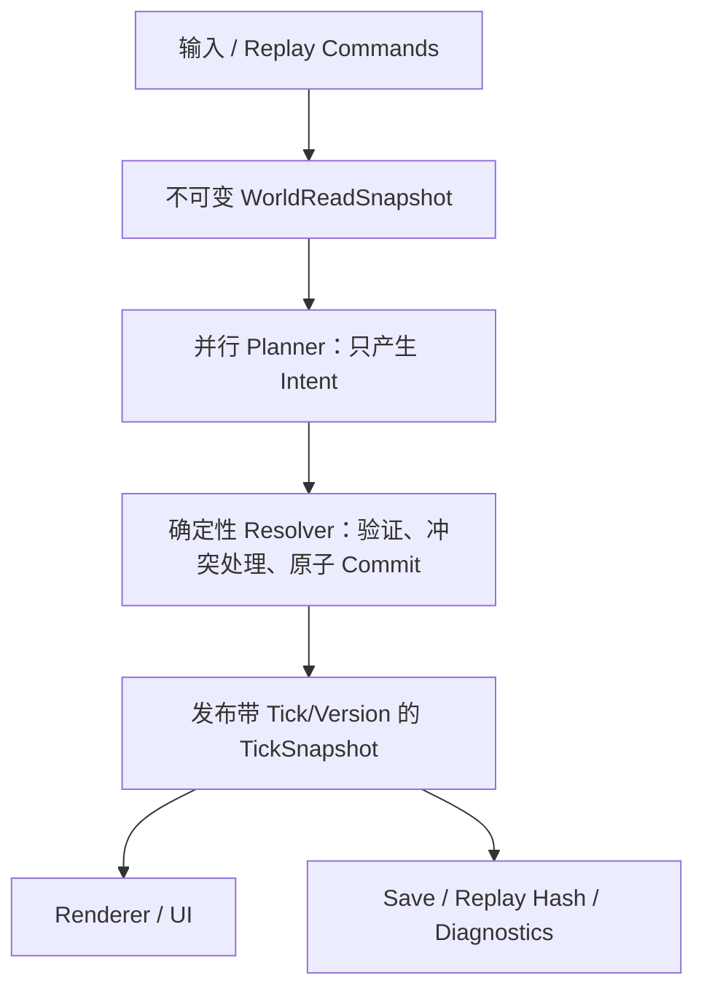

# TheFortressSimulation `main` 分支架构与代码审计报告

## 1. 执行摘要

本次审计基线固定为 `main` 分支提交 [`e4bf91ec506969f843578f809e7baf2cc277cfdc`](https://github.com/Lym666XD/TheFortressSimulation/commit/e4bf91ec506969f843578f809e7baf2cc277cfdc)，即 [`refactor1` 合并 PR #3](https://github.com/Lym666XD/TheFortressSimulation/pull/3) 后的状态。

核心结论：

> 这是一个“架构意识明显高于普通个人游戏项目、但权威模拟契约尚未闭合”的早期可玩原型。目前不具备可靠承载 Dwarf Fortress 级中大型长期模拟、完整存档兼容和确定性回放的工程基础。

不建议推倒重写。`Contracts / Core / Runtime / Simulation / Jobs / Navigation / Content / App` 的模块方向值得保留。但在继续增加战斗、复杂生物、流体、经济、Storyteller 等系统前，必须先修复身份、时间、所有权、事务、存档和快照几个基础契约。

当前推荐决策：

- 对“公开完整存档”“确定性回放”“中大型规模稳定运行”暂时作 **No-Go** 判断；
- 对“继续架构硬化、修复权威状态边界和建立 CI”作 **Go** 判断；
- 暂停大规模横向功能扩张，优先完成本报告中的 Blocker；
- 保留现有模块边界，逐步替换内部 mutation/ownership 模型。

## 2. 审计范围、方法与限制

### 2.1 审计范围

本次只读检查覆盖：

- `docs/` 下约 128 份 Markdown；
- 9 个生产项目和 1 个测试可执行项目；
- `src + tests` 约 70,824 行 C#；
- 模拟、导航、Jobs、存档、内容、WorldGen、Runtime、UI、测试和构建脚本；
- GitHub PR、提交历史、分支和仓库治理；
- 文档目标架构与当前代码实现的逐项对照。

### 2.2 仓库与合并基线

PR #3 一次改变了 1,079 个文件，约 `+43,860/-20,447`。GitHub 上未发现 review、讨论或 CI checks。这样的合并粒度在工程上无法进行有效人工审查，也无法通过自动化门禁证明其安全性。

最近 50 个提交中有 24 个提交信息仅为 `update`，不利于：

- 回归定位；
- `git bisect`；
- 版本说明；
- 变更影响分析；
- 未来多人协作。

### 2.3 验证限制

当前审计环境没有 .NET SDK，`dotnet --info` 返回 `command not found`，因此本报告不会声称项目成功构建或测试通过。

现有测试程序静态包含 117 个场景，但本次实际执行数为 0。

数据检查结果：

- 92/92 个 JSON 文件语法可解析；
- 但真正按 JSON Schema 校验时存在严重系统性失败；
- Python 工具脚本均可通过语法编译；
- 最终仓库 `git status` 为空，本次审计未修改仓库文件。

## 3. 总体评分

以下评分是相对于“中大型、长期运行、可确定性回放、可兼容存档的 DF 类模拟游戏”目标，而不是对早期原型完成度的否定。

| 维度 | 评分 | 判断 |
|---|---:|---|
| 架构意识与目标设计 | 8/10 | 对确定性、Diff、快照、数据驱动、模块边界有正确认识 |
| 静态模块边界 | 7/10 | App 只依赖 Contracts 与 Runtime，是本次重构的重要成果 |
| 当前模拟正确性 | 3/10 | 存在实体错配、物品索引损坏、导航穿建筑等数据级缺陷 |
| 确定性与回放 | 2/10 | 权威路径受 wall-clock 影响，预算和枚举顺序会分叉 |
| 存档与兼容性 | 2/10 | “Full Restore”丢 Tick、Jobs、Movement，并保存运行时 handle |
| 中大型扩展能力 | 3/10 | 多处 O(world) 扫描、O(N) 实体反查、每帧全量 DTO 构建 |
| 测试与 CI | 2/10 | 无 CI，测试不是标准可发现测试，脚本不能可靠传播失败 |
| 文档可信度 | 4/10 | 文档丰富，但多个 normative/current/final 文件互相矛盾 |
| 综合目标适配度 | 约 3/10 | 适合继续做架构硬化，不适合继续横向扩系统 |

## 4. 严重度定义

| 级别 | 含义 |
|---|---|
| B0 / Blocker | 在继续扩展核心玩法、公开存档或宣称确定性前必须解决 |
| P1 / High | 会导致回放分叉、作业错误、明显功能错误或规模崩溃 |
| P2 / Medium | 重要的工程、维护、文档、性能或语义债务 |

# 5. 阻断级问题

## B0-1：UI“快照”和存档都在读取正在被后台线程修改的 live world

模拟由独立 `SimulationTick` 线程运行，见 [`TickScheduler.cs:224–241`](https://github.com/Lym666XD/TheFortressSimulation/blob/e4bf91ec506969f843578f809e7baf2cc277cfdc/src/HumanFortress.Core/Time/TickScheduler.cs#L224-L241)。

但 UI 每帧调用 Runtime，而 Runtime 在调用线程上即时遍历 live world，见：

- [`FortressStateUpdateLoop.cs:33–46`](https://github.com/Lym666XD/TheFortressSimulation/blob/e4bf91ec506969f843578f809e7baf2cc277cfdc/src/HumanFortress.App/States/FortressStateUpdateLoop.cs#L33-L46)
- [`FortressRuntimeSessionCore.Snapshots.Frame.cs:20–65`](https://github.com/Lym666XD/TheFortressSimulation/blob/e4bf91ec506969f843578f809e7baf2cc277cfdc/src/HumanFortress.Runtime/FortressRuntimeSessionCore.Snapshots.Frame.cs#L20-L65)
- [`WorkshopSnapshotBuilder.cs:15–39`](https://github.com/Lym666XD/TheFortressSimulation/blob/e4bf91ec506969f843578f809e7baf2cc277cfdc/src/HumanFortress.Runtime/Snapshots/WorkshopSnapshotBuilder.cs#L15-L39)

`Chunk.GetTile()` 无读锁，而写线程替换的是一个 10-byte、CLR 不保证原子写入的结构体，见 [`Chunk.cs:43–75`](https://github.com/Lym666XD/TheFortressSimulation/blob/e4bf91ec506969f843578f809e7baf2cc277cfdc/src/HumanFortress.Simulation/World/Chunk.cs#L43-L75)。Creature/Item 查询虽然复制集合，却只复制可变对象引用。

可能结果：

- `Collection was modified`；
- 同一 UI 帧混合多个 Tick；
- Position 与 Z 来自不同写入阶段；
- 撕裂 Tile；
- 偶发幽灵物品、瞬移或面板崩溃。

这与文档规定的“模拟提交后发布 immutable snapshot，Renderer 不得读 live world”直接冲突，见 [`RENDERING_SNAPSHOT.md:19–39`](https://github.com/Lym666XD/TheFortressSimulation/blob/e4bf91ec506969f843578f809e7baf2cc277cfdc/docs/ui/RENDERING_SNAPSHOT.md#L19-L39)。

保存也有同样的问题：先分别捕获 Command、RNG、World，随后又重新计算 checkpoint/world hash，没有 barrier，见 [`FortressRuntimeSessionCore.SaveSnapshot.Build.cs:13–41`](https://github.com/Lym666XD/TheFortressSimulation/blob/e4bf91ec506969f843578f809e7baf2cc277cfdc/src/HumanFortress.Runtime/FortressRuntimeSessionCore.SaveSnapshot.Build.cs#L13-L41)。运行中保存可能随机失败，或不同 section 来自不同 Tick。

### 整改要求

在 PostTick 完成全部提交后，由模拟线程构建一次不可变 `TickSnapshot`，再原子交换引用。UI、存档、Replay Hash、调试面板只能消费已发布版本。

## B0-2：导航既不确定，也会把不完整路径当完整路径永久缓存

A* 使用 `Stopwatch.ElapsedMilliseconds` 决定搜索结果，见 [`DeterministicAStar.cs:74–83`](https://github.com/Lym666XD/TheFortressSimulation/blob/e4bf91ec506969f843578f809e7baf2cc277cfdc/src/HumanFortress.Navigation/DeterministicAStar.cs#L74-L83)。项目自己的确定性规范明确禁止模拟路径读取 `Stopwatch.Elapsed`，见 [`DETERMINISM_CI.md:190–199`](https://github.com/Lym666XD/TheFortressSimulation/blob/e4bf91ec506969f843578f809e7baf2cc277cfdc/docs/architecture/DETERMINISM_CI.md#L190-L199)。

更严重的是：

- 超过节点或时间预算后调用 `BuildPartialPath`；
- `BuildPartialPath` 又调用 `BuildCompletePath`；
- 后者无条件返回 `PathResultKind.Found`。

证据见 [`DeterministicAStar.cs:331–373`](https://github.com/Lym666XD/TheFortressSimulation/blob/e4bf91ec506969f843578f809e7baf2cc277cfdc/src/HumanFortress.Navigation/DeterministicAStar.cs#L331-L373)。

随后 `PathService` 会缓存所有 `Found` 路径，见 [`PathService.cs:43–59`](https://github.com/Lym666XD/TheFortressSimulation/blob/e4bf91ec506969f843578f809e7baf2cc277cfdc/src/HumanFortress.Navigation/PathService.cs#L43-L59)。

完整因果链：

1. 长路径搜索超预算；
2. 只走到 frontier 的截断路径被标成成功；
3. 以原始终点作为 key 缓存；
4. 同一请求反复得到这个到不了终点的“成功路径”。

此外：

- `InvalidateChunk()` 和 `ProcessQueuedRequests()` 没有生产调用者；
- cache key 只包含起点和终点 chunk 版本，忽略路径经过的中间 chunk，见 [`PathService.cs:124–138`](https://github.com/Lym666XD/TheFortressSimulation/blob/e4bf91ec506969f843578f809e7baf2cc277cfdc/src/HumanFortress.Navigation/PathService.cs#L124-L138)；
- 三个 Job 系统各自创建独立 PathService，更难统一失效。

### 整改要求

- 搜索结果只能由确定性的 node/edge budget 决定；
- wall-clock 只能决定是否开始下一项工作；
- Partial 必须有独立结果类型和 continuation token；
- Partial 绝不能进入完整路径缓存；
- topology commit 必须统一通知全部 cache。

## B0-3：建筑、家具和门没有进入导航能力图

Navigation snapshot 只将 `TileBase` 转换为 `NavigationTile`，完全不读取 Furniture、Placeable、DoorState 或 blocker，见 [`SimulationNavigationSource.Mapping.cs:21–30`](https://github.com/Lym666XD/TheFortressSimulation/blob/e4bf91ec506969f843578f809e7baf2cc277cfdc/src/HumanFortress.Runtime/Navigation/SimulationNavigationSource.Mapping.cs#L21-L30)。

因此完成一个 blocking workshop、墙类 placeable 或关闭门后：

- 碰撞层可能认为该格有建筑；
- Navigation 仍认为它是可走地板；
- 单位会规划并穿过建筑。

Placeable 虽然调用 `MarkTileDirty()`，但该方法只有 TODO 和版本自增，并没有加入 World 的 dirty chunk 集合，见 [`Chunk.cs:251–263`](https://github.com/Lym666XD/TheFortressSimulation/blob/e4bf91ec506969f843578f809e7baf2cc277cfdc/src/HumanFortress.Simulation/World/Chunk.cs#L251-L263)。实际导航重建只消费 `World.GetAndClearDirtyChunks()`，见 [`SimulationTickPipeline.PostTick.cs:56–65`](https://github.com/Lym666XD/TheFortressSimulation/blob/e4bf91ec506969f843578f809e7baf2cc277cfdc/src/HumanFortress.Runtime/Host/SimulationTickPipeline.PostTick.cs#L56-L65)。

跨 chunk 建筑进一步放大了问题：

- secondary chunk 只添加 external ref，不同步 FurnitureCell；
- external ref 解析仍是 TODO；
- 删除时只清 owner chunk，secondary ref 永久残留。

证据见：

- [`PlaceableManager.Placement.cs:55–94`](https://github.com/Lym666XD/TheFortressSimulation/blob/e4bf91ec506969f843578f809e7baf2cc277cfdc/src/HumanFortress.Simulation/Placeables/PlaceableManager.Placement.cs#L55-L94)
- [`ChunkPlaceableData.cs:27–38`](https://github.com/Lym666XD/TheFortressSimulation/blob/e4bf91ec506969f843578f809e7baf2cc277cfdc/src/HumanFortress.Simulation/Placeables/ChunkPlaceableData.cs#L27-L38)
- [`PlaceableManager.Removal.cs:40–59`](https://github.com/Lym666XD/TheFortressSimulation/blob/e4bf91ec506969f843578f809e7baf2cc277cfdc/src/HumanFortress.Simulation/Placeables/PlaceableManager.Removal.cs#L40-L59)

### 整改要求

建立统一 `TopologyChanged(cell)` 权威入口，同时处理 L0 terrain、L2 blocker/door、dirty tile、邻居、chunk version、nav rebuild 和 path cache invalidation。

## B0-4：物品堆叠会损坏位置索引并合并不兼容物品

[`ItemManager.MergeStacksAt`](https://github.com/Lym666XD/TheFortressSimulation/blob/e4bf91ec506969f843578f809e7baf2cc277cfdc/src/HumanFortress.Simulation/Items/ItemManager.Mutations.cs#L24-L77) 有两个独立问题。

第一，它只按 `DefinitionId` 分组，忽略：

- MaterialId；
- quality、condition、durability；
- artifact/provenance/improvements；
- owner、forbidden、reservation；
- 最大堆叠容量。

第二，每合并一个分组都执行：

```csharp
_posIndex[key] = new List<Guid> { targetId };
```

这会把同格其他 definition 和 singleton 的位置索引全部删除。

例如同一格有 `wood#1、wood#2、stone#1`，合并 wood 后，`stone#1` 仍存在于全局实例表，但从位置查询中消失。搬运、库存区、建造材料查询都可能再也看不到它。

### 整改要求

- 引入严格的 `StackCompatibilityKey`；
- 遵守最大 stack cap；
- 只从原索引移除真正被吞并的 GUID；
- 保持其余 surviving IDs；
- merge 作为事务操作返回完整结果和拒绝原因。

## B0-5：GUID 被截断成 32-bit，规模上来后动作会发给错误实体

[`DiffTargetEncoding.EntityId`](https://github.com/Lym666XD/TheFortressSimulation/blob/e4bf91ec506969f843578f809e7baf2cc277cfdc/src/HumanFortress.Core/Simulation/DiffTargetEncoding.cs#L48-L56) 只取 GUID 前 32 位。

移动、携带和 Diff 合并都使用这个值作为实体身份。物品反查则线性扫描并返回第一个匹配者，见 [`ItemManager.Queries.cs:20–33`](https://github.com/Lym666XD/TheFortressSimulation/blob/e4bf91ec506969f843578f809e7baf2cc277cfdc/src/HumanFortress.Simulation/Items/ItemManager.Queries.cs#L20-L33)。

若 ID 近似均匀分布，32-bit birthday collision 概率约为：

| 实体数量 | 至少一次碰撞概率 |
|---:|---:|
| 10,000 | 1.16% |
| 50,000 | 25.25% |
| 77,163 | 约 50% |
| 100,000 | 68.78% |

对于包含大量物品的 DF 类游戏，这不是边角情况。碰撞后可能移动、携带或删除另一实体，`DiffLog` 还会把碰撞实体的操作合并掉。

### 整改要求

- 运行时使用不复用的 `ulong EntityId`，或带 generation 的 handle；
- GUID 仅作为持久化/外部 identity；
- 建立 O(1) `EntityId ↔ entity` 索引；
- restore 时验证唯一性和 allocator high-water mark。

## B0-6：“Full Restore”并不完整，却可能返回成功

World payload 只保存 chunks、items、creatures、reservations、zones、placeables 和 orders，见 [`WorldSavePayloadData.cs:8–26`](https://github.com/Lym666XD/TheFortressSimulation/blob/e4bf91ec506969f843578f809e7baf2cc277cfdc/src/HumanFortress.Contracts/Simulation/Save/WorldSavePayloadData.cs#L8-L26)。

它没有保存：

- transport/mining/craft/construction executor active jobs；
- backlog、planner cursor、deferred requests；
- MovementExecutor 状态；
- profession assignments；
- entity allocator cursor；
- scheduler 当前 Tick。

然而 manifest 又声明 `jobs.transport/mining/craft` hash，形成“验证了但无法恢复”的假象。

更严重的是，恢复创建新 Session 时 Tick 被重置为 0，而 Full Restore 没有从 manifest 恢复 Tick，见：

- [`TickScheduler.ResetForNewSession:207–218`](https://github.com/Lym666XD/TheFortressSimulation/blob/e4bf91ec506969f843578f809e7baf2cc277cfdc/src/HumanFortress.Core/Time/TickScheduler.cs#L207-L218)
- [`FortressRuntimeSessionCore.SaveSnapshot.Restore.cs:68–145`](https://github.com/Lym666XD/TheFortressSimulation/blob/e4bf91ec506969f843578f809e7baf2cc277cfdc/src/HumanFortress.Runtime/FortressRuntimeSessionCore.SaveSnapshot.Restore.cs#L68-L145)

后果包括：

- future commands 执行时间错误；
- reservation TTL、腐烂、冷却和生产进度错位；
- active job 消失；
- workshop 仍保存 `ActiveJobs/IsScheduled/ActiveWorkerId`，但实际 executor 为空，产生僵尸工坊；
- reservation 可能保留到过期，却再无对应作业。

规范要求从 `last_tick + 1` 恢复，见 [`SAVE_FORMAT.md:277–295`](https://github.com/Lym666XD/TheFortressSimulation/blob/e4bf91ec506969f843578f809e7baf2cc277cfdc/docs/architecture/SAVE_FORMAT.md#L277-L295)。当前实现不满足。

Full Restore 还按 World → RNG → Commands 顺序直接修改当前状态。如果最后 command decode 失败，方法返回失败，但 World 和 RNG 已被替换，不具备事务性。

项目较新的文档已经正确警告“暂时不要实现/公开完整存档”，见 [`SAVE_REPLAY_ARCHITECTURE.md:12–28`](https://github.com/Lym666XD/TheFortressSimulation/blob/e4bf91ec506969f843578f809e7baf2cc277cfdc/docs/architecture/SAVE_REPLAY_ARCHITECTURE.md#L12-L28)。当前 API 应明确标为实验性 checkpoint，不应称为 Full Restore。

### 整改要求

- 保存全部未来行为相关的权威状态；
- 恢复 Tick 后再恢复 pending commands；
- restore 到临时 Session；
- 所有验证成功后一次性交换 active Session；
- 缺少 job/movement 状态时返回 `Partial/Unsupported`，不得返回完整成功。

## B0-7：存档保存运行时内容 handle，内容变化会静默错绑

存档规范明确要求“用字符串 ID 重绑定，不保存 runtime handles”，见 [`SAVE_FORMAT.md:10–16`](https://github.com/Lym666XD/TheFortressSimulation/blob/e4bf91ec506969f843578f809e7baf2cc277cfdc/docs/architecture/SAVE_FORMAT.md#L10-L16)。

实际 Tile payload 直接保存 `ushort GeoMatId`，见 [`WorldSavePayloadData.cs:51–64`](https://github.com/Lym666XD/TheFortressSimulation/blob/e4bf91ec506969f843578f809e7baf2cc277cfdc/src/HumanFortress.Contracts/Simulation/Save/WorldSavePayloadData.cs#L51-L64)。

如果 content 增删或排序变化，同一个 numeric handle 可以指向另一 geology/material。当前 restore 也不比较存档 content signature 与当前 content。

内容 Hash 本身也不足以防止问题：

- 总 Hash 只包含 material hash、terrain version、biome 数量，见 [`ContentRegistry.TuningZonesValidation.cs:176–185`](https://github.com/Lym666XD/TheFortressSimulation/blob/e4bf91ec506969f843578f809e7baf2cc277cfdc/src/HumanFortress.Content/Registry/ContentRegistry.TuningZonesValidation.cs#L176-L185)；
- Material hash 只包含 `Id:Name:Category`，忽略所有机械属性，见 [`MaterialRegistry.cs:362–381`](https://github.com/Lym666XD/TheFortressSimulation/blob/e4bf91ec506969f843578f809e7baf2cc277cfdc/src/HumanFortress.Content/Registry/MaterialRegistry.cs#L362-L381)；
- recipes、construction、items、creatures、geology、zones、tunings 没有形成完整 canonical hash。

### 整改要求

- 保存 canonical string ID，或随存档保存完整局部 ID table；
- 为所有影响模拟行为的 catalog 生成规范化 section hash；
- Load 时先验证/迁移内容签名，再创建 runtime handles；
- hash 输入必须包含所有机械属性、schema/version 和稳定排序。

## B0-8：Reservation 没有所有权安全，旧作业可以释放新作业的锁

[`ReservationManager`](https://github.com/Lym666XD/TheFortressSimulation/blob/e4bf91ec506969f843578f809e7baf2cc277cfdc/src/HumanFortress.Simulation/Jobs/ReservationManager.cs#L35-L113) 的 release API 只有资源 ID，没有 holder/token：

```csharp
ReleaseItem(Guid itemId)
ReleaseCreature(Guid workerId)
```

可能出现：

1. Job A 的 reservation 过期；
2. Job B 获得同一资源；
3. A 的延迟 cancel/finalize 执行；
4. A 无条件删除 B 的 reservation。

Creature reservation 还把同一 `HolderSystem` 的不同 job 当成同一持有者。

### 整改要求

Acquire 返回不可伪造的 `(resource, owner, generation)` token；Release 必须 compare-and-remove，且 job identity 必须进入所有权判断。

# 6. Diff、Tick 与 Job 架构问题

当前 Diff 系统更接近“分类型排序后逐条应用”，还不是事务性 resolver。

[`SimulationTickPipeline.PostTick.cs:19–54`](https://github.com/Lym666XD/TheFortressSimulation/blob/e4bf91ec506969f843578f809e7baf2cc277cfdc/src/HumanFortress.Runtime/Host/SimulationTickPipeline.PostTick.cs#L19-L54) 依次提交 item、world、creature、order、workshop、zone、stockpile diff。中间失败时，之前的 log 已经提交，后面的可能不再执行，产生半事务。

`TickScheduler` 对 Read/Write 的系统调用会 catch，但：

- Read 失败后仍可能执行该系统 Write；
- quarantine 仍是 TODO；
- PreTick、Barrier、PostTick 没有顶层 catch；
- 这些异常可能直接终止模拟线程。

见 [`TickScheduler.cs:339–444`](https://github.com/Lym666XD/TheFortressSimulation/blob/e4bf91ec506969f843578f809e7baf2cc277cfdc/src/HumanFortress.Core/Time/TickScheduler.cs#L339-L444)。

“Read 阶段只读”也没有真实约束。例如 [`CraftPlanner.ReadTick`](https://github.com/Lym666XD/TheFortressSimulation/blob/e4bf91ec506969f843578f809e7baf2cc277cfdc/src/HumanFortress.Jobs/Craft/CraftPlanner.cs#L45-L86) 会直接修改 workshop queue 状态，然后 `WriteTick` 反而注释“Planner is read-only”。

### 建议模型

- `WorldReadSnapshot` 不暴露任何 mutation API；
- Planner 只生成 immutable intents；
- Resolver 统一验证资源、版本、容量、所有权；
- Commit 产生 accepted/rejected/partial 结果；
- 一个 transaction 要么完整提交，要么执行明确补偿；
- Read 阶段失败的系统本 Tick 不进入 Commit。

# 7. 确定性、公平性与性能

## 7.1 带预算的无序扫描

多个带预算的系统总是从集合开头重新扫描，或者遍历未形成稳定协议的 Dictionary/ConcurrentDictionary：

- CraftPlanner 每 Tick 只看前 N 个 workshop；
- ConstructionMaterialsPlanner 每 Tick 只看前 N 个 site；
- Sanitizer 每次只处理枚举顺序最早的实体；
- HaulingSystem 消费 one-shot designation；若没有 stockpile 或超过预算，剩余工作可能永久丢失。

这会同时造成：

- 饥饿；
- save/load 后行为变化；
- 不同进程、Runtime 或 Dictionary bucket 顺序下回放分叉；
- 前部对象长期占用预算，后部对象无法获得服务。

Mining planner 已经使用持久 cursor 和稳定排序，是更好的参照实现。

## 7.2 明确的复杂度热点

- `GetAllInstances()` 和 `GetGroundInstances()` 每次复制全表；
- creature movement diff 每条都全扫 creatures；
- construction material planner 对每个 site/requirement 反复全扫 items；
- workshop 查找反复扫描所有 chunks/placeables；
- UI 每帧构建 catalog、jobs、workshops、stockpile 和 map DTO；
- compact entity lookup 是 O(N)，多单位移动可能退化成 O(N²)。

### 整改要求

- `EntityId → entity` O(1) 索引；
- chunk/local spatial index；
- item tag/material availability broker；
- workshop GUID index；
- 稳定的工作队列与 round-robin cursor；
- dirty chunk/row snapshot；
- 在优化前建立可重复的 benchmark 和 allocation budget。

# 8. Content 与数据驱动审计

当前 Schema 只是“被读取”，没有真正用于验证。

[`ContentRegistry.LoadContentAsync`](https://github.com/Lym666XD/TheFortressSimulation/blob/e4bf91ec506969f843578f809e7baf2cc277cfdc/src/HumanFortress.Content/Registry/ContentRegistry.cs#L65-L166) 加载 schema 为 `JsonDocument`，随后各 loader 接收 `schemas` 参数，但实际解析流程没有执行 JSON Schema validator。

即便 `ValidationResult.Errors.Count > 0`，代码仍设置：

```text
IsLoaded = true
Content loaded successfully
```

本次显式 AJV/draft-07 检查结果：

- 35 个本地 `$schema` 引用中有 31 个指向不存在的路径；
- items 仅 1/20 通过；
- recipes 3/8 通过；
- workshops 0/20 通过；
- constructions 1/4 通过；
- materials、terrain、geology 主文件也存在 schema 不兼容。

这意味着数据驱动目前没有可靠 fail-closed 入口。

另一个例子是 input bindings：配置服务被 Load，但实际输入仍由硬编码 handler 决定；配置中的 F4–F7 已经与 UI 的 F4–F8 映射漂移。现在属于“坏配置会阻止启动，好配置却不决定行为”。

### 建议建立确定性 Content Compiler

1. Authoring JSON 是唯一手写源；
2. Schema 全量验证；
3. 跨引用验证；
4. 生成 canonical runtime snapshot；
5. CI 校验生成物无差异；
6. 对 canonical 内容做完整 hash；
7. Core pack 严格失败，mod pack 按 pack 隔离失败。

# 9. UI 中已确认的直接功能缺陷

## P1-1：缩放后实体和 overlay 与地形错位

Ctrl+滚轮允许 Zoom 1–4，见 [`FortressMouseWheelInput.cs:36–40`](https://github.com/Lym666XD/TheFortressSimulation/blob/e4bf91ec506969f843578f809e7baf2cc277cfdc/src/HumanFortress.App/Input/FortressMouseWheelInput.cs#L36-L40)。

Terrain 使用 `screen / zoom` 计算 world cell，见 [`MapViewportSnapshotBuilder.Terrain.cs:22–42`](https://github.com/Lym666XD/TheFortressSimulation/blob/e4bf91ec506969f843578f809e7baf2cc277cfdc/src/HumanFortress.Runtime/Snapshots/MapViewportSnapshotBuilder.Terrain.cs#L22-L42)。

但 entity 使用 `world - camera`，完全没有乘 zoom，见 [`MapViewportSnapshotBuilder.Entities.cs:23–47`](https://github.com/Lym666XD/TheFortressSimulation/blob/e4bf91ec506969f843578f809e7baf2cc277cfdc/src/HumanFortress.Runtime/Snapshots/MapViewportSnapshotBuilder.Entities.cs#L23-L47)。Mining、orders、workshops、stockpile、zone 等 overlay 有相同问题。

复现：Ctrl+滚轮到 2x/3x，单位、物品、工坊和区域标记显示在错误 tile。

## P1-2：相机移动后点击会使用旧 hover 世界坐标

[`FortressMapClickInput.cs:15–19`](https://github.com/Lym666XD/TheFortressSimulation/blob/e4bf91ec506969f843578f809e7baf2cc277cfdc/src/HumanFortress.App/Input/FortressMapClickInput.cs#L15-L19) 只要 `LastMousePosition` 有值，就完全忽略本次 click local position。

而相机移动和缩放不会清空或重算该值，见 [`FortressViewportState.cs:32–47`](https://github.com/Lym666XD/TheFortressSimulation/blob/e4bf91ec506969f843578f809e7baf2cc277cfdc/src/HumanFortress.App/Rendering/FortressViewportState.cs#L32-L47)。

复现：移动鼠标产生 hover，保持鼠标不动，用 WASD 移动相机或缩放，再点击；命令落在移动前的世界坐标。

### 整改要求

建立唯一 `WorldScreenTransform`，由 terrain、entity、overlay、hover 和 click 共用。Click 必须使用本次事件坐标，hover 只能作为显示状态。

# 10. 目标架构文档自身的高风险问题

以下问题不只是“尚未实现”，而是目标设计本身不应照搬。

| 文档问题 | 风险与建议 |
|---|---|
| Diff 先定义“数值越高优先级越高”，又定义 `Priority(desc)` 后取最后一个；当前代码则是数值越小优先 | 三套相反语义会让同格冲突选错赢家。见 [`DIFF_LOG_AND_MERGE_STRATEGIES.md:60–132`](https://github.com/Lym666XD/TheFortressSimulation/blob/e4bf91ec506969f843578f809e7baf2cc277cfdc/docs/architecture/DIFF_LOG_AND_MERGE_STRATEGIES.md#L60-L132) 与 [`DiffLog.cs:171–182`](https://github.com/Lym666XD/TheFortressSimulation/blob/e4bf91ec506969f843578f809e7baf2cc277cfdc/src/HumanFortress.Core/Simulation/DiffLog.cs#L171-L182)。必须用 ADR 固定方向并做 property tests。 |
| Chunk Actor 在 Tick T 把实体加入接收方，Tick T+1 才从发送方删除 | 至少一个 Tick 内复制实体；崩溃或存档可永久复制。见 [`CHUNK_ACTOR_PROTOCOL.md:276–305`](https://github.com/Lym666XD/TheFortressSimulation/blob/e4bf91ec506969f843578f809e7baf2cc277cfdc/docs/architecture/CHUNK_ACTOR_PROTOCOL.md#L276-L305)。需要 escrow/transactional transfer。 |
| 权威 LOD 读取 camera、UI inspect，并改变 AI/Jobs/Fluids 执行频率 | 世界结果取决于玩家看哪里，可被利用，headless replay 无法等价。见 [`SIM_LOD_POLICY.md:15–51`](https://github.com/Lym666XD/TheFortressSimulation/blob/e4bf91ec506969f843578f809e7baf2cc277cfdc/docs/architecture/SIM_LOD_POLICY.md#L15-L51)。Camera 只能影响渲染和预取。 |
| Chunk 一处定义为 `32×32×Zc`，另一处定义单 Z 的 `ChunkKey(cx,cy,z)` | 所有权、存档、halo、流体、LOD 和 actor 粒度没有统一。见 [`CHUNK_AND_DATA_LAYOUT.md:10–23`](https://github.com/Lym666XD/TheFortressSimulation/blob/e4bf91ec506969f843578f809e7baf2cc277cfdc/docs/architecture/CHUNK_AND_DATA_LAYOUT.md#L10-L23) 与 [`TILE_SPEC.md:3–10`](https://github.com/Lym666XD/TheFortressSimulation/blob/e4bf91ec506969f843578f809e7baf2cc277cfdc/docs/simulation/TILE_SPEC.md#L3-L10)。必须先选定并写 ADR。 |
| Save Format 使用固定 shard 文件名逐个 replace，最后替换 manifest | 若中途崩溃，旧 manifest 会指向新旧混合 shard，并非真正 whole-save atomic。见 [`SAVE_FORMAT.md:45–70`](https://github.com/Lym666XD/TheFortressSimulation/blob/e4bf91ec506969f843578f809e7baf2cc277cfdc/docs/architecture/SAVE_FORMAT.md#L45-L70)。应写 immutable generation directory，最后只原子替换 generation pointer。 |
| Error Policy 承诺所有异常都 catch 并继续，甚至 integrity breach 也不退出 | 在缺少事务提交时，会把程序错误转化成静默世界腐坏。应终止当前 Session 并保留最后已提交 checkpoint。 |
| “唯一九阶段 Update Order”与单 Commit Barrier、每 Stage Barrier 文档互相矛盾 | 无法容纳 AI、Jobs、Movement、Combat、Temperature 等系统，也没有闭合的 happens-before 契约。应改为显式 Stage DAG。 |
| Fluid 文档同时存在 byte depth 单流体和多 channel/ml 两套权威模型 | 守恒、跨 chunk 回压和存档模型无法闭合。应先选择一个 v1 权威模型。 |

### 必须尽快固化的 ADR

- Priority 方向；
- 单 Z Chunk 或体积 Chunk；
- Tick/Stage DAG；
- 跨 Chunk 原子所有权协议；
- 权威 LOD 输入；
- save generation/commit 语义；
- 可恢复错误与 invariant failure 的边界；
- Fluid v1 的唯一权威模型。

# 11. 测试、CI 与仓库治理

当前测试项目是普通 `OutputType=Exe`，没有 `Microsoft.NET.Test.Sdk`、xUnit、NUnit 或 MSTest，见 [`HumanFortress.App.Tests.csproj`](https://github.com/Lym666XD/TheFortressSimulation/blob/e4bf91ec506969f843578f809e7baf2cc277cfdc/tests/HumanFortress.App.Tests/HumanFortress.App.Tests.csproj#L1-L18)。

[`Program.cs`](https://github.com/Lym666XD/TheFortressSimulation/blob/e4bf91ec506969f843578f809e7baf2cc277cfdc/tests/HumanFortress.App.Tests/Program.cs#L11-L30) 串行调用六组 `RunAll()`，最后根据输出字符串判断失败。因此：

- `dotnet test` 无法发现独立测试；
- 无 filter、TRX、coverage、timeout、retry；
- 某个异常会阻断后续场景；
- 多个性能测试实际上只打印 PASS 或软警告；
- App 输入、缩放、hit-test、render snapshot 几乎没有行为覆盖。

`RunTests.sh` 硬编码 Apple Silicon Homebrew 路径，并使用 `--no-restore`，见 [`RunTests.sh`](https://github.com/Lym666XD/TheFortressSimulation/blob/e4bf91ec506969f843578f809e7baf2cc277cfdc/RunTests.sh#L1-L6)。Windows 脚本也没有可靠传播测试 DLL 的退出码。

仓库没有：

- GitHub Actions；
- `global.json`；
- locked restore；
- central package management；
- 根 README、LICENSE、SECURITY、CONTRIBUTING；
- 可执行的跨 OS determinism gate。

全局 [`Directory.Build.props`](https://github.com/Lym666XD/TheFortressSimulation/blob/e4bf91ec506969f843578f809e7baf2cc277cfdc/src/Directory.Build.props#L1-L12) 关闭 warnings-as-errors，并压制包括 `CA1031` 等大量规则。对涉及持久化和并发的项目来说范围过宽。

仓库 pack 约 111 MiB，包含大量 vendored SadConsole HTML/PDF、`.DS_Store`、空文件，以及 solution 中失效的根文档引用。它们不是运行时 Blocker，但会持续恶化 clone、review 和维护成本。

# 12. 值得保留的部分

此次重构具有明确价值，以下设计应继续保留：

- App 只引用 Contracts 与 Runtime，见 [`HumanFortress.App.csproj:17–20`](https://github.com/Lym666XD/TheFortressSimulation/blob/e4bf91ec506969f843578f809e7baf2cc277cfdc/src/HumanFortress.App/HumanFortress.App.csproj#L17-L20)；
- Contracts、实现项目和 Runtime composition root 的方向清晰；
- 大部分实现类已 internal/friend，减少了随意跨模块调用；
- CommandQueue 使用锁内单调 sequence，并按 `(tick, sequence)` 稳定执行，见 [`CommandQueue.cs:20–82`](https://github.com/Lym666XD/TheFortressSimulation/blob/e4bf91ec506969f843578f809e7baf2cc277cfdc/src/HumanFortress.Core/Commands/CommandQueue.cs#L20-L82)；
- Replay record 对 payload 做防御性复制；
- TileBase 连续数组和稀疏 overlay 是合理的内存演进起点；
- A* 邻居顺序和 heap tie-break 有明确的确定性意识；
- World/Placeable replay hash 的稳定排序设计方向正确；
- 当前单文件 save store 使用 temp、flush-to-disk 和 replace，作为原型阶段的单文件原子写入是合格的；
- Mining planner 的稳定排序和持久 cursor 值得作为其他 planner 的模板；
- 文档索引已经有 Current/Target/Archive 分类意识，见 [`docs/INDEX.md:6–14`](https://github.com/Lym666XD/TheFortressSimulation/blob/e4bf91ec506969f843578f809e7baf2cc277cfdc/docs/INDEX.md#L6-L14)。

# 13. 推荐的目标运行时结构



核心原则：

- 只有 Commit 阶段能修改权威状态；
- Planner 看不到 mutation API；
- wall-clock 不参与权威决策；
- Job、Movement、Reservation、Item transfer 都有 transaction/owner token；
- 保存和渲染消费同一个已提交 TickSnapshot；
- Renderer 永不调用 live world；
- 所有跨 Chunk 资源转移同时 debit source、credit destination；
- 远程模拟 LOD 由世界活动和权威角色决定，Camera 只影响渲染和预取。

# 14. 推荐整改顺序

## 第一阶段：建立红线门禁

先把下面问题全部变成自动化回归：

1. Stack merge 不得丢其他物品索引；
2. Partial path 不得标为 Found 或进入完整缓存；
3. Blocking placeable/door 必须影响导航；
4. Compact entity ID 碰撞必须被禁止；
5. Save/load 必须恢复 Tick；
6. Active job save/load 不能静默成功；
7. Zoom 1–4 的世界/屏幕坐标一致；
8. 相机变化后 click 使用当前坐标；
9. Reservation 只能由当前 owner token 释放；
10. Content schema/reference 必须 100% 有效。

同时迁移到标准测试 SDK，并建立 GitHub Actions：Linux/Windows/macOS、Debug/Release、测试、严格 content load、publish smoke。

## 第二阶段：关闭权威状态缺口

- 发布式 immutable TickSnapshot；
- 运行时 64-bit EntityId；
- 统一 TopologyChanged + Nav cache invalidation；
- owner/generation reservation token；
- 稳定 work queue/cursor；
- World、Jobs、Movement、allocator cursor 的完整 checkpoint；
- save/load 全过程先构建临时 Session，全部验证成功后一次性交换。

## 第三阶段：建立真正的确定性事务

- `WorldReadSnapshot → Intent → Resolve → Commit`；
- 为每个 intent 增加 transaction id、producer sequence 和资源版本；
- accepted/rejected/partial result 回馈 Job；
- 一个 Job 的 item split、move、carry、reservation、stockpile index 形成同一事务；
- Read 阶段失败的系统本 Tick 不得进入 Write；
- invariant breach 终止当前 Session，而不是 catch 后继续半写状态。

## 第四阶段：再做规模优化

建议先定义可重复的规模档位：

| 档位 | 建议初始负载 |
|---|---|
| Early | 50 workers / 10k items |
| Mid | 250 workers / 50k items |
| Target | 1,000 workers / 100k items / 10k active+queued jobs |
| Stress | 多 Z、建筑跨 chunk、大量 path requests 和 active fluids |

每档至少记录：

- Tick p50/p95/p99；
- 分系统耗时和 allocation；
- path expansions/request；
- dirty chunks/tick；
- snapshot bytes/tick；
- save capture 时间和峰值内存；
- 1 线程与 N 线程的最终 replay hash。

达到测量阈值后再引入 Region/Portal Graph、flow field、chunk-parallel resolve、hot/cold ECS split。当前阶段直接引入完整 Actor/ECS/GPU 会放大尚未解决的所有权和事务问题。

# 15. 验收门禁

| 门禁 | 最低验收条件 |
|---|---|
| 权威状态边界 | App/Renderer/Save 不存在 live World 遍历 |
| 确定性 | 同 seed/input 在重复运行、thread=1/N 后 hash 相同 |
| 跨平台 | Windows/Linux/macOS headless replay 最终 hash 相同 |
| Save continuation | Tick T 保存，Load 后运行 N Tick，与未保存分支状态完全相同 |
| 资源守恒 | Item split/merge/haul/craft/跨 chunk transfer 满足数量与身份守恒 |
| Reservation | 所有 release 都验证 owner/generation token |
| Content | Schema、引用、生成物、canonical hash 全部通过 CI |
| Navigation | Terrain、door、placeable、跨 chunk topology 变更均正确失效 |
| UI | Zoom 1–4 的 terrain/entity/overlay/hit-test 使用同一 transform |
| 性能 | 在目标硬件和目标负载上满足明确的 Tick p95/p99 与内存预算 |
| 合并治理 | main 受 required checks 保护；大 PR 必须拆分并有 review |

# 16. 最终判断

这个项目值得继续，而且此次模块边界重构方向总体正确。但当前 `main` 应被视为“架构原型基线”，不能视为已经准备承载中大型长期模拟的核心。

最优先的下一组工作不应是新玩法系统，而应是：

> 发布式快照边界 + 标准 CI + 实体身份 + 事务性 Job/Reservation + 正确导航拓扑 + 可证明的 save/load continuation。

只要这些基础建立起来，现有模块结构可以逐步演化成可靠的中大型模拟架构；如果跳过它们继续增加系统数量，当前缺陷会以物品丢失、作业僵尸、路径错误、存档腐坏和不可复现分叉的形式指数放大。

---

审计说明：本报告为只读静态审计结果。审计基线为 `main@e4bf91ec506969f843578f809e7baf2cc277cfdc`，审计过程中未修改仓库文件。由于环境缺少 .NET SDK，构建和测试没有被实际执行；相关结论均已在报告中明确区分为代码确认缺陷、静态验证结果或目标架构风险。
